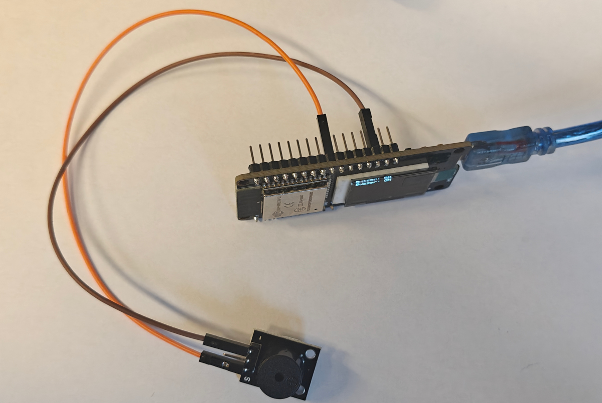

# 📝 **Lekcja: Sterowanie pasywnym buzzerem KY-006 i wyświetlanie jego stanu na OLED**

## 🔍 1. Co to jest moduł KY-006?



**KY-006** to moduł z **pasywnym buzzerem piezoelektrycznym**

- **Nie ma wewnętrznego generatora** – aby wydawał dźwięk, musi otrzymać **sygnał zmienny (PWM)** o określonej **częstotliwości**.
- **Może grać różne tony** – im wyższa częstotliwość, tym wyższy dźwięk.
- **Zakres słyszalny**: zwykle **1 kHz – 5 kHz** (poniżej 100 Hz lub powyżej 10 kHz dźwięk może być niesłyszalny).
- **3 piny**: `VCC`, `GND`, `I/O` (sygnał sterujący).

> ⚠️ **Uwaga**:  
> Prawdziwy **aktywny buzzer** wydaje dźwięk po podaniu `HIGH` – **ten nie**!  
> Jeśli słychać tylko „kliknięcie” przy zasilaniu – to **pasywny buzzer**.

---

## 🔌 2. Jak podłączyć KY-012 i OLED do ESP32?

| Element       | ESP32        | Uwagi |
|---------------|--------------|-------|
| **KY-006 GND** | `GND`        |       |
| **KY-006 I/O** | `GPIO 13`    | Sygnał PWM – **nie może być pinem 20, 24+ na ESP32** |


> ✅ ESP32 obsługuje funkcję `tone()` na pinach: **0–19, 21–23** – **GPIO13 jest poprawny**.

---

## 💻 3. Struktura projektu

W projekcie mamy **dwa pliki**:
- `main.ino` – główny program (poniżej)
- `sensor_kit.cpp` – nasz własny moduł z klasą `KY006`

---

## 📄 4. Kod z komentarzami – `main.ino`

```cpp
// main.ino – KY-006 Buzzer + OLED
#include "../sensor_kit.cpp"  // zawiera: KY006, OledHelper

// Buzzer na GPIO13
KY006 buzzer(13);

// Czas ostatniego testu
unsigned long lastTest = 0;

// Ekran OLED – domyślne piny (SDA=5, SCL=4)
OledHelper oled;

void setup() {
  if (!oled.begin()) {
    for (;;); // awaria OLED
  }
  oled.showText("KY-006\nTones");
  delay(1000);
}

void loop() {
  // Obsługa automatycznego wyłączania dźwięku
  buzzer.update();

  // Co 3 sekundy: inny ton
  if (millis() - lastTest > 3000) {
    static uint8_t step = 0;
    switch (step) {
      case 0: buzzer.beep(1000, 300); break; // niski
      case 1: buzzer.beep(2000, 300); break; // średni
      case 2: buzzer.beep(3000, 300); break; // wysoki
      case 3: buzzer.beep(4000, 300); break; // bardzo wysoki
    }
    step = (step + 1) % 4;
    lastTest = millis();
  }

  // --- Wyświetl stan buzzera – prosto i bez bufora! ---
  oled.clear();
  oled.print("Buzzer: ");
  oled.print(buzzer.getState()); // "ON" lub "OFF"
  oled.update();

  delay(100);
}
```

---

## 🧠 5. Kluczowe pojęcia do omówienia na lekcji

| Pojęcie | Wyjaśnienie |
|--------|-------------|
| **Pasywny buzzer** | Element wymagający zewnętrznego sygnału PWM – nie ma wewnętrznego generatora |
| **Częstotliwość (Hz)** | Liczba drgań na sekundę – decyduje o wysokości dźwięku |
| **`tone(pin, freq)`** | Funkcja Arduino generująca sygnał PWM o danej częstotliwości |
| **`millis()`** | Czas od uruchomienia (w ms) – pozwala na nieblokujące opóźnienia |
| **`update()`** | Metoda, która **musi być wywoływana w `loop()`** – obsługuje funkcję `beep()` |

---

## ⚠️ 6. Typowe problemy i ich rozwiązania

| Problem | Możliwa przyczyna | Rozwiązanie |
|--------|------------------|------------|
| **Nie ma dźwięku** | Buzzer podłączony do złego pinu | Użyj pinu z zakresu 0–19 lub 21–23 |
| | Zasilanie 3.3V zbyt słabe | Podłącz VCC do **5V** (sygnał I/O nadal z GPIO!) |
| | Buzzer aktywny (nie pasywny) | Sprawdź, czy po `HIGH` jest ciągły dźwięk – jeśli tak, to inny typ |
| **Dźwięk nie wyłącza się** | Brak `buzzer.update()` | Upewnij się, że ta linia jest w `loop()` |

---

## 🎯 7. Zadania dla uczniów (rozszerzenie)

1. **Stwórz syrenę**: naprzemiennie odtwarzaj 800 Hz i 1200 Hz co 200 ms.
2. **Zagraj nuty**: C = 523 Hz, D = 587 Hz, E = 659 Hz – zrób sekwencję.
3. **Połącz z przyciskiem**: po naciśnięciu – pisk 2000 Hz na 500 ms.
4. **Alarm temperaturowy**: jeśli temperatura > 28°C, graj 3000 Hz przez 1 s co 2 s.
5. **Zmierz zakres słyszalności**: znajdź najniższą i najwyższą częstotliwość, którą słychać.

---

> 💡 **Ciekawostka**:  
> Człowiek słyszy dźwięki w zakresie **20 Hz – 20 000 Hz**, ale z wiekiem górna granica spada.  
> Większość buzzera dobrze brzmi w zakresie **2–4 kHz** – to właśnie częstotliwość alarmów!
