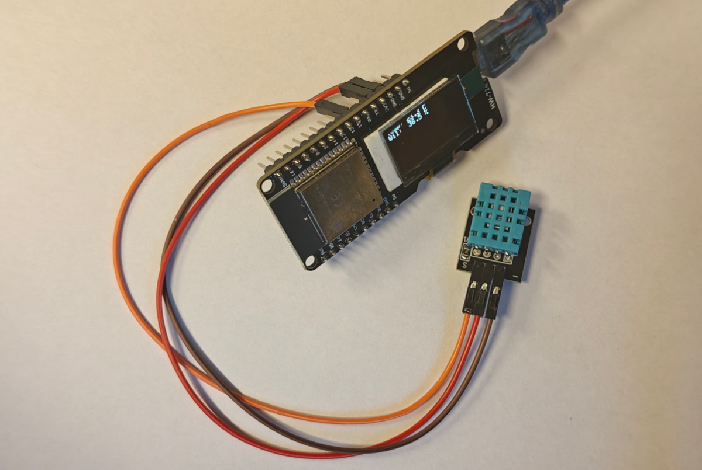

# 📝 **Lekcja: Odczyt temperatury i wilgotności z KY-015 i wyświetlanie odczytu na OLED**

## 🔍 1. Co to jest czujnik DHT11?



**DHT11** to **niedrogi, cyfrowy czujnik** temperatury i wilgotności, często używany w projektach edukacyjnych i IoT.

- **Zakres temperatury**: 0°C do 50°C (dokładność ±2°C)  
- **Zakres wilgotności**: 20% do 90% (dokładność ±5%)  
- **Interfejs**: cyfrowy, **1-pinowy** (protokół własny firmy Aosong)  
- **Częstotliwość odczytu**: max. **raz na 2 sekundy** (nie można czytać szybciej!)

---

## 🔌 2. Jak podłączyć DHT11 do ESP32?

| Element       | ESP32        | Uwagi |
|---------------|--------------|-------|
| **DHT11 VCC** | `3.3V`       | Nie podłączaj do 5V! |
| **DHT11 GND** | `GND`        |       |
| **DHT11 DATA**| `GPIO 15`    | Pin danych – do niego podłączamy sygnał |


> ✅ Większość modułów DHT11 ma **wbudowany rezystor pull-up (4.7kΩ)** – jeśli nie, należy dodać go między **DATA** a **VCC**.

---

## 💻 3. Struktura projektu

W projekcie mamy **dwa pliki**:
- `main.ino` – główny program (poniżej)
- `sensor_kit.cpp` – nasz własny moduł z klasą `KY015`

---

## 📄 4. Kod z komentarzami – `main.ino`

```cpp
// main.ino – KY-037 + OLED
#include "../sensor_kit.cpp"

KY037 sound(39);
const int LOUD_THRESHOLD = 60;
OledHelper oled;

void setup() {
  if (!oled.begin()) for (;;);
  oled.showText("KY-037\nSound");
  delay(1000);
}

void loop() {
  int percent = sound.read();
  oled.showLevel("Sound", percent, LOUD_THRESHOLD);
  delay(50);
}
```

---

## 🧠 5. Kluczowe pojęcia do omówienia na lekcji

| Pojęcie | Wyjaśnienie |
|--------|-------------|
| **I2C** | Magistrala szeregowa do komunikacji z OLED (używa SDA i SCL) |
| **GPIO** | Ogólne piny cyfrowe mikrokontrolera (tutaj: GPIO4, GPIO5, GPIO15) |
| **Pull-up** | Rezystor łączący sygnał z VCC – zapewnia stabilny stan "1" |
| **delay(2000)** | Opóźnienie |

---

## ⚠️ 6. Typowe problemy i ich rozwiązania

| Problem | Możliwa przyczyna | Rozwiązanie |
|--------|------------------|------------|
| **"BLAD DHT11!"** | Źle podłączony czujnik | Sprawdź VCC, GND, DATA |
| | Brak rezystora pull-up | Dodaj 4.7kΩ między DATA a VCC |

---

## 🎯 7. Zadania dla uczniów (rozszerzenie)

1. Zmień pin DHT11 na inny (np. GPIO 32) – co trzeba zmienić?
2. Zrób alarm: jeśli temperatura > 30°C, wyświetl "GORĄCO!".
