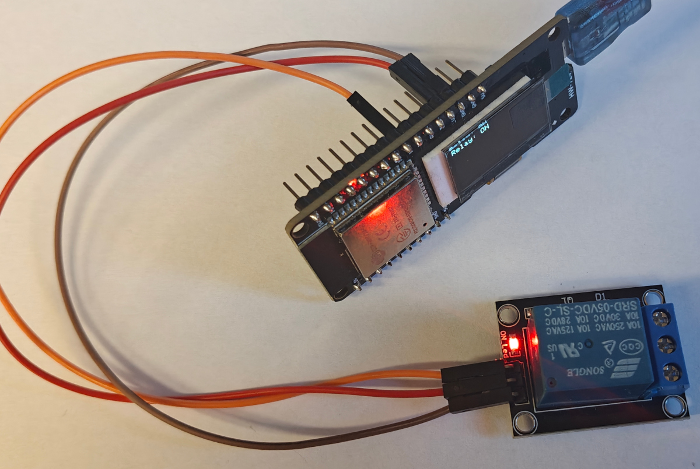

# 📝 **Lekcja: Sterowanie przekaźnikiem KY-019 i wyświetlanie jego stanu na OLED**

## 🔍 1. Co to jest moduł KY-019?



**KY-019** to **moduł przekaźnika** – element wykonawczy, który pozwala na **włączanie/wyłączanie urządzeń o dużym poborze mocy** (np. lampy, wentylatory, grzałki) za pomocą mikrokontrolera o niskim napięciu (np. ESP32).

- **Napięcie sterujące (IN)**: 3.3V – kompatybilne z ESP32  
- **Napięcie zasilania przekaźnika (VCC)**: 3.3V lub 5V (zależnie od wersji modułu)  
- **Prąd przełączany**: zwykle do 10A przy 250V AC (sprawdź oznaczenia na przekaźniku!)  
- **Tryb pracy**: **aktywny wysoki** – `HIGH` = przekaźnik **ZAŁĄCZONY**, `LOW` = **WYŁĄCZONY**

> ⚠️ **Uwaga bezpieczeństwa**:  
> Przekaźnik może przełączać prąd sieciowy! W szkołach **należy używać tylko niskiego napięcia** (np. LED, mały silnik na 5–12V).

---

## 🔌 2. Jak podłączyć KY-019 i OLED do ESP32?

| Element       | ESP32        | Uwagi |
|---------------|--------------|-------|
| **KY-019 VCC** | `3.3V` lub `5V` | Jeśli przekaźnik nie działa na 3.3V → użyj 5V |
| **KY-019 GND** | `GND`        |       |
| **KY-019 IN**  | `GPIO 13`    | Sygnał sterujący (3.3V logic!) |
| **OLED VCC**   | `3.3V`       |       |
| **OLED GND**   | `GND`        |       |
| **OLED SDA**   | `GPIO 5`     | Linia danych I2C |
| **OLED SCL**   | `GPIO 4`     | Linia zegara I2C |

> ✅ Większość modułów KY-019 ma **diodę sygnalizacyjną** – świeci, gdy przekaźnik jest załączony.

---

## 💻 3. Struktura projektu

W projekcie mamy **dwa pliki**:
- `main.ino` – główny program (poniżej)
- `sensor_kit.cpp` – nasz własny moduł z klasą `KY019`


---

## 📄 4. Kod z komentarzami – `main.ino`

```cpp
// main.ino – KY-019 + OLED

#include <Wire.h>                // obsługa komunikacji I2C (do OLED)
#include <Adafruit_GFX.h>        // grafika podstawowa (tekst, linie)
#include <Adafruit_SSD1306.h>    // obsługa konkretnie OLED SSD1306
#include "../sensor_kit.cpp"     // nasz własny moduł KY019

// --- Ustawienia wyświetlacza OLED ---
#define SCREEN_WIDTH 128    // szerokość ekranu w pikselach
#define SCREEN_HEIGHT 64    // wysokość ekranu w pikselach
#define OLED_ADDR 0x3C      // adres I2C wyświetlacza (sprawdź, jeśli nie działa!)
#define OLED_SDA 5          // pin SDA → GPIO5 na ESP32
#define OLED_SCL 4          // pin SCL → GPIO4 na ESP32

// Tworzymy obiekt "display", który obsługuje OLED
// -1 oznacza, że nie używamy pinu RESET
Adafruit_SSD1306 display(SCREEN_WIDTH, SCREEN_HEIGHT, &Wire, -1);

// --- Inicjalizacja przekaźnika KY-019 na pinie 13 ---
KY019 relay(13);  // GPIO13 → sygnał sterujący

// Zmienne do automatycznego testowania
unsigned long lastToggle = 0;

void setup() {
  // Inicjalizujemy magistralę I2C z WŁAŚCIWYMI pinami (ważne na ESP32!)
  Wire.begin(OLED_SDA, OLED_SCL);

  // Próba uruchomienia OLED
  if (!display.begin(SSD1306_SWITCHCAPVCC, OLED_ADDR)) {
    for (;;); // Zawieś program – nie ma sensu działać bez ekranu
  }

  // Pierwszy komunikat na ekranie
  display.clearDisplay();         // wyczyść ekran
  display.setTextSize(1);         // rozmiar tekstu (1 = mały)
  display.setTextColor(SSD1306_WHITE); // kolor biały (OLED ma tylko czarno-biały)
  display.setCursor(0, 0);        // ustaw kursor na początek
  display.println("KY-019 + OLED"); // tekst
  display.display();              // WYŚWIETL – bez tego NIC się nie pokaże!
  delay(1000);                    // pokaż komunikat przez 1 sekundę
}

void loop() {
  // WAŻNE: update() obsługuje automatyczne wyłączanie po czasie
  relay.update();

  // Co 5 sekund włącz przekaźnik na 2 sekundy (do testu działania)
  if (millis() - lastToggle > 5000) {
    relay.on(2000); // włącz na 2000 ms
    lastToggle = millis();
  }

  // --- Wyświetlenie stanu przekaźnika na OLED ---
  display.clearDisplay();         // wyczyść ekran przed nowym tekstem
  display.setCursor(0, 0);        // początek tekstu
  display.print("Relay: ");
  display.println(relay.getState()); // "ON " lub "OFF"
  display.display();              // pokaż tekst na ekranie!

  delay(100); // niewielkie opóźnienie – zapobiega migotaniu OLED
}
```

---

## 🧠 5. Kluczowe pojęcia do omówienia na lekcji

| Pojęcie | Wyjaśnienie |
|--------|-------------|
| **Przekaźnik** | Elektromechaniczne „przekaźnikowe” przełącznik – pozwala na sterowanie dużym obciążeniem małym sygnałem |
| **GPIO** | Ogólne piny cyfrowe mikrokontrolera (tutaj: GPIO13 dla przekaźnika, GPIO4/5 dla OLED) |
| **`millis()`** | Funkcja zwracająca czas od uruchomienia (w ms) – pozwala na nieblokujące opóźnienia |
| **`update()`** | Metoda, która **musi być wywoływana w `loop()`** – obsługuje funkcję „włącz na czas” |
| **Aktywny wysoki** | Przekaźnik załącza się przy sygnale `HIGH` (niektóre moduły działają odwrotnie!) |

---

## ⚠️ 6. Typowe problemy i ich rozwiązania

| Problem | Możliwa przyczyna | Rozwiązanie |
|--------|------------------|------------|
| **Przekaźnik nie klika** | Zasilanie 3.3V zbyt słabe | Podłącz **VCC do 5V**, **IN nadal do GPIO13 (3.3V!)** |
| | Błędny pin | Sprawdź, czy `KY019 relay(13);` i fizyczne podłączenie |
| **OLED nie działa** | Zły adres I2C | Sprawdź, czy adres to `0x3C` (czasem bywa `0x3D`) |
| | Brak `relay.update()` | Bez tej linii **nie działa tryb czasowy**! |
| **Stan "ON" nie znika** | Nie wywołano `update()` często | Upewnij się, że `relay.update()` jest w `loop()` |

---

## 🎯 7. Zadania dla uczniów (rozszerzenie)

1. **Dodaj przycisk** – jeśli naciśnięty, włącz przekaźnik na 3 sekundy.
2. **Zmodyfikuj kod**, by przekaźnik włączał się **ręcznie** (bez automatycznego testu).
3. **Połącz z czujnikiem** – jeśli temperatura > 25°C, włącz wentylator (przekaźnik).
4. **Dodaj dźwięk** – użyj buzzerka, by sygnalizować załączenie przekaźnika.
5. **Zbadaj, czy Twój przekaźnik działa na 3.3V** – podłącz VCC do 3.3V i 5V, sprawdź, czy słychać „klik”.

