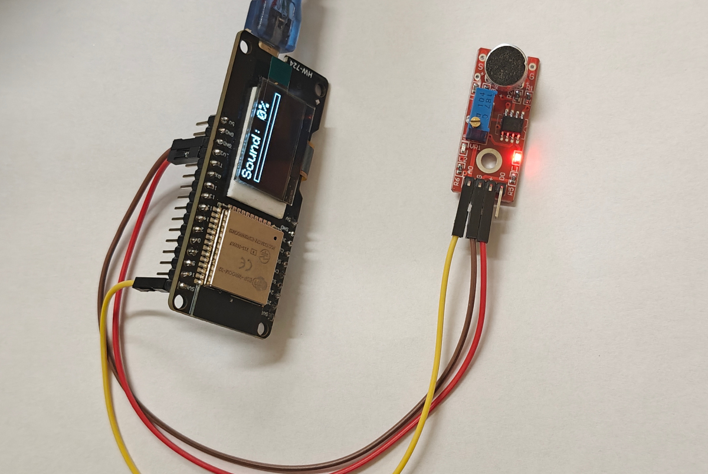

# 📝 **Lekcja: Pomiar głośności dźwięku z modułem KY-037 i wyświetlanie na OLED**

## 🔍 1. Co to jest moduł KY-037?



**KY-037** to **analogowy czujnik dźwięku** oparty na **mikrofonie elektretowym** ze wzmacniaczem. Służy do wykrywania **intensywności dźwięku (głośności)** w otoczeniu.

- **Typ wyjścia**: tylko **analogowe (A0)** – nie ma cyfrowego D0 (w przeciwieństwie do KY-038),
- **Zasilanie**: 3.3V (kompatybilne z ESP32),
- **Wyjście**: napięcie proporcjonalne do **głośności** – im głośniej, tym wyższa wartość,
- **Potencjometr**: służy do regulacji **wzmocnienia** sygnału (nie progu!).

> ⚠️ **Uwaga**:  
> Mikrofon nie mierzy „głośności” bezpośrednio – zwraca **chwilowe napięcie**.  
> Aby uzyskać sensowny wynik, trzeba **analizować odchylenie od poziomu spoczynkowego**, co realizuje nasza klasa `KY037`.

---

## 🔌 2. Jak podłączyć KY-037 i OLED do ESP32?

| Element       | ESP32        | Uwagi |
|---------------|--------------|-------|
| **KY-037 VCC** | `3.3V`      | **Nie podłączaj do 5V!** |
| **KY-037 GND** | `GND`       |       |
| **KY-037 A0**  | `GPIO 39`   | Pin analogowy |


> ✅ **GPIO 39** to pin **tylko do odczytu analogowego** – idealny dla czujników.

---

## 💻 3. Struktura projektu

https://app.arduino.cc/sketches/ff5e3992-ac57-475f-aaca-a3f332fbd4d1?view-mode=preview

W projekcie mamy **dwa pliki**:
- `main.ino` – główny program (poniżej)
- `sensor_kit.cpp` – nasz własny moduł z klasą  **`KY037`**

---

## 📄 4. Kod z komentarzami – `main.ino`

```cpp
// main.ino – KY-037 + OLED
#include "../sensor_kit.cpp"

KY037 sound(39);
const int LOUD_THRESHOLD = 60;
OledHelper oled;

void setup() {
  if (!oled.begin()) for (;;);
  oled.showText("KY-037\nSound");
  delay(1000);
}

void loop() {
  int percent = sound.read();
  oled.showLevel("Sound", percent, LOUD_THRESHOLD);
  delay(50);
}
```

---

## 🧠 5. Kluczowe pojęcia do omówienia na lekcji

| Pojęcie | Wyjaśnienie |
|--------|-------------|
| **Analogowy sygnał dźwięku** | Mikrofon generuje zmienne napięcie – nie jest to bezpośrednia „głośność” |
| **Poziom spoczynkowy** | Wartość ADC w ciszy (ok. połowa zakresu) – od niej liczymy odchylenie |
| **Detekcja szczytu (peak detection)** | Analiza wielu próbek w krótkim czasie, by znaleźć maksymalne odchylenie |
| **Przeskalowanie do 0–100%** | Ułatwia interpretację – uczniowie rozumieją procenty lepiej niż 0–4095 |
| **ADC (analog-to-digital converter)** | Przetwornik w ESP32, który zamienia napięcie na liczbę (0–4095) |

---

## ⚠️ 6. Typowe problemy i ich rozwiązania

| Problem | Możliwa przyczyna | Rozwiązanie |
|--------|------------------|------------|
| **Pasek się nie porusza** | Zły pin analogowy | Użyj pinu 32–39 na ESP32 |
| | Moduł zasilany 5V | Podłącz **VCC do 3.3V** |
| **Wartości zbyt wysokie w ciszy** | Brak kalibracji | Klasa sama kalibruje się – wystarczy chwila ciszy po uruchomieniu |
| **Nie reaguje na dźwięk** | Zbyt niskie wzmocnienie | Kręć potencjometrem na module KY-037 (zwykle lewo/prawo) |


---

## 🎯 7. Zadania dla uczniów (rozszerzenie)

1. **Dostosuj próg**: zmień `LOUD_THRESHOLD`, by reagował tylko na klaśnięcia.
2. **Steruj RGB LED**: jeśli `isLoud()`, ustaw kolor na czerwony.
3. **Licz klaśnięcia**: zwiększ licznik za każdym razem, gdy wykryty zostanie głośny dźwięk.
4. **Symuluj wu-meter**: pasek reaguje na muzykę z telefonu przyłożonego do mikrofonu.
5. **Alarm hałasu w klasie**: jeśli głośność > 70% przez 5 sekund – włącz buzzer.

---

> 💡 **Ciekawostka**:  
> Prawdziwe **mierniki hałasu (decybelometry)** używają skomplikowanych algorytmów i kalibracji.  
> Nasz projekt to **uproszczony model** – ale doskonale pokazuje, jak sprzęt reaguje na świat fizyczny!
