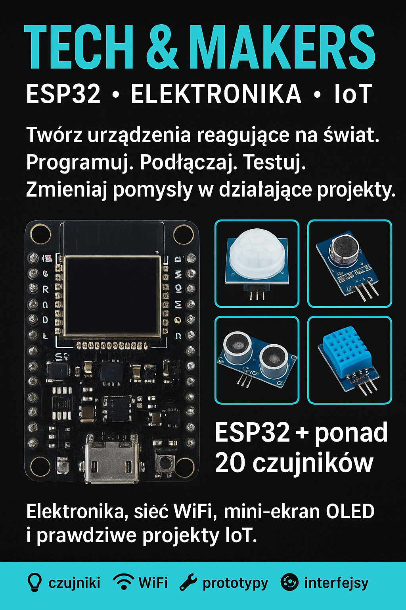

# Elektronika i Internet Rzeczy z ESP32

W ramach zajęć uczniowie pracują z nowoczesną płytką ESP32 wyposażoną w moduł WiFi 
oraz niewielki wyświetlacz OLED. Do dyspozycji mają również szeroki zestaw czujników, 
m.in. temperatury, wilgotności, ruchu, światła, dźwięku, poziomu wody, odległości czy wibracji. 
Dzięki temu mogą eksperymentować z wieloma zjawiskami i poznawać sposób działania urządzeń, które spotyka się w inteligentnych domach i rozwiązaniach IoT.
Zajęcia mają charakter praktycznych warsztatów. Uczniowie samodzielnie podłączają elementy, programują płytkę i sprawdzają działanie swoich pomysłów na żywo. Pracują zarówno 
z wyświetlaczem OLED, jak i z komunikacją WiFi, co pozwala im poznawać różne sposoby prezentowania danych oraz tworzenia prostych rozwiązań sieciowych.

W trakcie cyklu zajęć uczniowie mają okazję:
* uczyć się programowania w środowisku Arduino IDE,
* poznawać zasady działania czujników wykorzystywanych w robotyce i automatyce,
* tworzyć własne układy reagujące na otoczenie,
* obserwować, jak urządzenia komunikują się przez sieć,
* realizować indywidualne pomysły z wykorzystaniem dostępnych modułów.

Dzięki połączeniu elektroniki, programowania i rozwiązań IoT uczestnicy zdobywają praktyczne umiejętności, które są coraz częściej wykorzystywane w nowoczesnych technologiach. 
Zajęcia rozwijają kreatywność, samodzielność i zdolność projektowania działających urządzeń elektronicznych.

## Spis treści

Wstęp
  *  - instalacja i konfiguracja do pracy Arduino IDE
  *  - biblioteki, zmienne, warunki, pętle i obiekty
  *  - pierwszy program i napis na ekranie OLED
  *  - metody obsługi OLED

Moduły
  *  - generowanie dźwięku
  *  - odczyt temperatury i wilgotności
  *  - RGB LED ze wspólną katodą
  *  - sterowanie przekaźnikiem
  *  - joystick
  *  - pomiar głośności dźwięku

Zadania
  *  - poruszanie kwadratem po ekranie za pomocą joysticka

---

